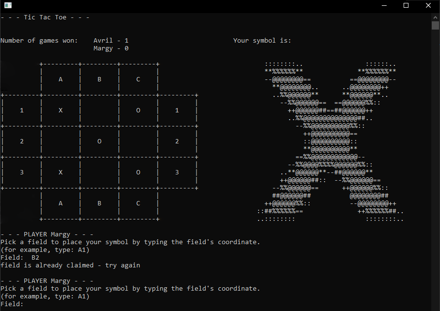

# Aufgabenstellung

- Es gibt ein Spielfeld mit `3 x 3 Feldern`.
- Die beiden Spielenden setzen ihre Symbole `Kreuz` und `Kreis` abwechselnd in ein freies Feld.
- Wer zuerst sein Symbol in drei Felder einer `Zeile`, `Spalte` oder `Diagonalen` setzen kann, gewinnt.
- Das Spiel endet unentschieden, wenn alle Felder gesetzt sind, ohne dass jemand gewonnen hat.
- Das Programm ermöglicht es zwei Spielenden, gegeneinander anzutreten, und achtet dabei auf die Einhaltung dieser Regeln.

Löse die Aufgabe bitte mit `C#` und wähle dabei einen objektorientierten Ansatz.

# Solution Features

- play [`Tic Tac Toe`](https://en.wikipedia.org/wiki/Tic-tac-toe) in a console window
- create two players at a time
- name your player or get assigned a random name
- the playing field is displayed in the console window
- the current player's symbol is displayed in the console window

   <!--  -->
   

- type in the coordinates of the field you want to place your symbol in

   

- the field can't already be claimed by any player

   

- the player to put three of their symbols in a vertical, horizontal or diagonal line wins

   

- the game is over when a player wins or when there are no empty fields left

   

- have a rematch and keep track of both players' score ..
- .. or start a new game with new players

   <!--  -->
   
